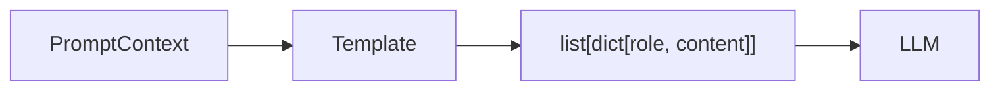

<div align="center">

# 💭 Agent Prompt Templates

**Reusable prompt templates for AI agents — CoT, ReAct, ToT, Few-shot, and more.**

[](https://pypi.org/project/agent-prompt-templates/)
[](https://pypi.org/project/agent-prompt-templates/)
[](LICENSE)

</div>

---

Stop copy-pasting prompt snippets between projects. This library gives you production-ready templates for every major prompting technique.

```python
from agent_prompt_templates import ReAct, ChainOfThought, FewShot
from agent_prompt_templates.base import PromptContext

# ReAct — for tool-use agents
prompt = ReAct(available_tools=["search(query)", "read_file(path)"])
messages = prompt.build(PromptContext(question="What files changed yesterday?"))

# Chain of Thought — for complex reasoning
prompt = ChainOfThought()
messages = prompt.build(PromptContext(question="If a train travels 120km in 2h, speed?"))

# Few-shot — teach with examples
prompt = FewShot(examples=[
    {"input": "2 + 2", "output": "4"},
    {"input": "3 + 5", "output": "8"},
])
messages = prompt.build(PromptContext(question="5 + 7 = ?"))
```

## 📦 Install

```bash
pip install agent-prompt-templates
```

> Python 3.9+

## 🧠 Templates

### Chain of Thought (CoT)

Decompose complex problems step by step.

```python
from agent_prompt_templates import ChainOfThought
from agent_prompt_templates.base import PromptContext

prompt = ChainOfThought(include_verification=True, max_steps=5)
messages = prompt.build(PromptContext(
    question="If John has 3 apples and gives 2 to Mary, then buys 4 more — how many?"
))
```

Also available: **`ZeroShotCoT`** — just adds "Think step by step." Works surprisingly well.

### ReAct (Reason + Act)

Interleave reasoning with tool calls.

```python
from agent_prompt_templates import ReAct

prompt = ReAct(
    available_tools=["search(query)", "read_file(path)", "run_cmd(cmd)"],
    max_steps=8,
)
messages = prompt.build(PromptContext(question="What was committed yesterday?"))
```

Also available: **`ReActXML`** — uses XML tool tags, great for open-source models.

### Self-Ask

Explicitly ask sub-questions before answering.

```python
from agent_prompt_templates import SelfAsk

prompt = SelfAsk(max_subquestions=5)
messages = prompt.build(PromptContext(
    question="Who was the father of the current president of the US?"
))
```

Also available: **`SelfConsistency`** — sample multiple paths, vote on the answer.

### Tree of Thoughts

Explore multiple reasoning branches in parallel.

```python
from agent_prompt_templates import TreeOfThoughts

prompt = TreeOfThoughts(
    n_branches=3,
    max_depth=4,
    evaluation_criteria="Does this lead to a correct answer?",
)
messages = prompt.build(PromptContext(question="Best approach to migrate this codebase?"))
```

### Few-Shot

Teach patterns with examples.

```python
from agent_prompt_templates import FewShot

prompt = FewShot(
    examples=[
        {"input": "Translate to French: hello", "output": "bonjour"},
        {"input": "Translate to French: goodbye", "output": "au revoir"},
    ],
    style="input_output",
)
messages = prompt.build(PromptContext(question="Translate to French: thanks"))
```

### System Prompts

Common roles with built-in constraints.

```python
from agent_prompt_templates import CodeReviewer, DataAnalyst, Teacher

# Code review with guidelines
reviewer = CodeReviewer()
messages = reviewer.build(PromptContext(question=code_snippet))

# Data analysis with rigor
analyst = DataAnalyst()
messages = analyst.build(PromptContext(question="What does this data show?"))
```

## 🏗️ Architecture



All templates accept a `PromptContext` and return a list of message dicts ready for any LLM API.

## 📖 API

### `PromptContext`

```python
context = PromptContext(
    question="What is 2+2?",    # required
    examples=[...],             # optional, for few-shot
    system="extra context",    # optional
    extra={"key": "value"},     # optional, template-specific
)
```

### `BasePrompt`

```python
messages = prompt.build(context)      # → list[dict] (for chat APIs)
text = prompt.render(context)         # → str (for completion APIs)
```

## ✅ Included Templates

| Template | Use When |
|---|---|
| `ChainOfThought` | Complex reasoning, math, logic |
| `ZeroShotCoT` | Quick CoT with no setup |
| `ReAct` | Tool-use agents, RAG, function calling |
| `ReActXML` | Open-source models with XML tool formats |
| `SelfAsk` | Multi-hop questions, decomposition |
| `SelfConsistency` | High-stakes tasks where accuracy matters |
| `TreeOfThoughts` | Strategic planning, creative problems |
| `FewShot` | Teaching specific formats or patterns |
| `CodeReviewer` | Code review tasks |
| `DataAnalyst` | Data analysis tasks |
| `Teacher` | Educational content |

---

## 📄 License

[MIT](LICENSE)
